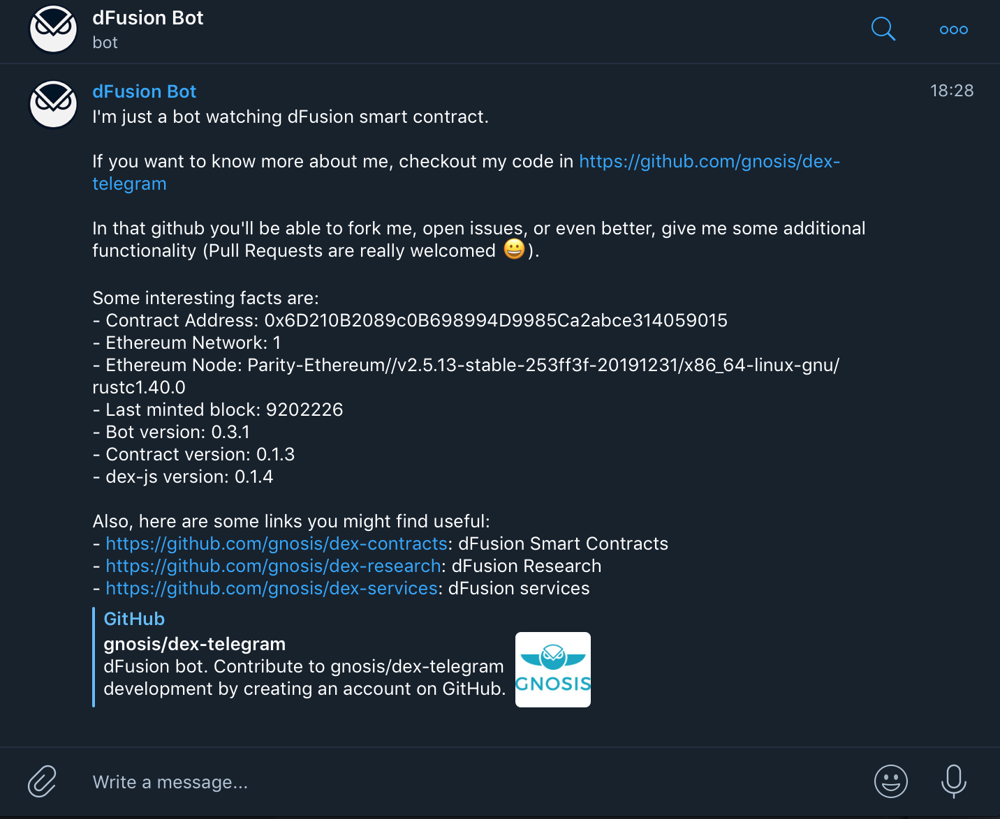

[](https://npmjs.org/package/@gnosis.pm/dex-telegram 'View this project on npm')
&nbsp;
[](https://travis-ci.org/gnosis/dex-telegram)
&nbsp;
[](https://coveralls.io/github/gnosis/dex-telegram?branch=master)

Develop:
&nbsp;
[](https://travis-ci.org/gnosis/dex-telegram)
&nbsp;
[](https://coveralls.io/github/gnosis/dex-telegram?branch=develop)

# Gnosis Protocol Telegram Bots



Telegram bot watching the smart contracts of [Gnosis Protocol](https://docs.gnosis.io/protocol)

Right now the bots notify every time someone sends an order to the protocol. You can watch all markets, or you can set a list of markets your channel is interested in.

Although it's not implemented right now, this project can easily be forked or accept PRs, so the bots could potentially:

- Report trades, prices, solutions
- Allow users to register any address so they are notified every time one of the orders is executed (partially or totally)
- Even a full client of Gnosis Protocol (prices, submit orders, history) could potentially be implemented with the help of https://thegraph.com/explorer/subgraph/gnosis/protocol

---

## Tutorial

- [Setup your own bot](https://docs.gnosis.io/protocol/docs/tutorial-telegram-bot/)

---

## Setup environment variables

Create a `.env` file using [.env.example](.env.example) as a template.

You'll need to setup the Telegram token and the channel in the `.env` file or as environment variables when you run the process.

Every environment variable in the [.env.example](.env.example) has hints of what it does, and how you can set it up for your use case.

## Run in develop

> First setup the environment variables

```bash
# Install dependencies
yarn install

# Run
yarn dev
```

## Run with docker

> First setup the environment variables

**Option 1: Run dockerhub image**
See all available tagged images:

- [https://hub.docker.com/r/gnosispm/dex-telegram/tags](https://hub.docker.com/r/gnosispm/dex-telegram/tags)

```bash
# For example, run the develop branch
docker run --env-file .env gnosispm/dex-telegram:develop
```

**Option 2: Use docker compose**
First setup the environment variables using [.env.example](.env.example) as a template.

Then run docker compose:

```bash
docker-compose up
```

## Run in Production

> First setup the environment variables

First setup the environment variables using [.env.example](.env.example) as a template.

```bash
# Install dependencies
yarn install

# Build project
yarn build

# Run
yarn start
```

## liveness probes

The app will expose two endpoints to verify the liveness of it.

By default, the API is exposed in port `3000`, but it can be changed using `API_PORT` environment var.

The endpoints using the default port would be available at:

- http://localhost:3000/v1/health/ping
- http://localhost:3000/v1/health/healthy
